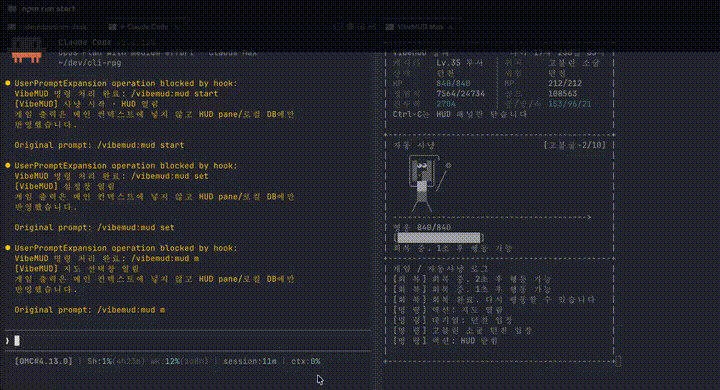

# VibeMUD

<p align="center">
  
  
  
  
  
  
</p>

<p align="center">
  <strong>Claude Code 옆에서 조용히 돌아가는 로컬 터미널 방치형 RPG</strong><br />
  Rust 런타임 · SQLite 저장소 · Claude Code slash command · HUD side pane
</p>

---

VibeMUD는 Claude Code 옆에서 조용히 돌아가는 **로컬 터미널 방치형 RPG**입니다. 게임은 별도 Rust 런타임, SQLite DB, HUD 화면에서만 진행되며, 코딩 중인 소스 파일·프롬프트·대화 기록·에디터 버퍼를 게임 상태로 읽지 않습니다.

<span style="color:#ff6b00"><strong>코딩으로 토큰을 태우는 순간, 후킹된 피버타임이 켜지고 당신의 모험도 함께 가속됩니다.</strong></span>

## 데모



GitHub README에서 바로 움직이는 미리보기는 GIF로 제공하며, 전체 화질 영상은 [데모 영상 MP4](assets/vibe_and_play_ad.mp4)를 직접 열어보세요.

## 시나리오

당신은 코드의 균열 속 미지의 던전에 떨어진 개발자입니다. 몬스터를 사냥하고 성장해 최종 토너먼트에서 승리하면 지구로 돌아갈 수 있습니다.

## 빠른 시작: Claude Code

현재 README의 사용자용 실행 가이드는 **Claude Code slash command 경로만** 유효합니다. Codex, iTerm2, 기타 미검증 터미널을 지원 경로처럼 안내하지 않습니다.

### 1) 설치

Claude Code에서 사용할 때는 CLI가 먼저 `PATH` 또는 `VIBEMUD_BIN_DIR`에 있어야 합니다.

공개 npm preview 패키지(`latest`는 2026-05-16 확인 기준 `0.1.25`):

```bash
npm install -g vibemud
```

로컬 개발 설치:

```bash
scripts/install.sh --for claude --scope local
```

Claude Code marketplace 사용 시:

```bash
claude plugin marketplace add angelyrlove40-svg/vibe-and-play
claude plugin install vibemud@vibemud
```

### 2) 게임 시작

Claude Code를 재시작한 뒤, 아래 가이드만 기본 사용법으로 안내합니다.

```text
/vibemud:mud start   # 자동 사냥 시작 + 가능한 경우 HUD pane 열기
/vibemud:mud c       # 캐릭터/능력치
/vibemud:mud i       # 장비/소지품
/vibemud:mud m       # 지도/던전
/vibemud:mud q       # 퀘스트
/vibemud:mud set     # 설정 / 오프닝 다시보기
/vibemud:mud end     # 종료/정리
```

플러그인 hook은 VibeMUD slash command를 Claude 본문 프롬프트로 넘기기 전에 처리합니다. 명시적으로 verbose/live 출력을 요청하지 않으면 안전한 확인 메시지만 반환합니다.

## 현재 지원 상태

지원 표기는 실제 smoke 결과 기준입니다. **2026-05-16 현재 side-pane/HUD 자동화 검증 완료 대상은 tmux, cmux, macOS Ghostty뿐입니다. Codex와 iTerm2는 동작 실패가 확인되어 현재 미지원입니다.**

| 대상 | 현재 공개 상태 | 메모 |
| --- | --- | --- |
| Claude Code plugin | ✅ 지원 | `/vibemud:mud ...` slash-command + HUD pane 경로 |
| tmux | ✅ 검증 완료 | Claude Code 옆 오른쪽 HUD pane smoke 완료 |
| cmux | ✅ 검증 완료 | Claude Code에서 오른쪽 cmux HUD pane smoke 완료 |
| macOS Ghostty | ✅ 검증 완료 | Ghostty native split/HUD smoke 완료 |
| macOS Apple Silicon npm/npx | ✅ preview | npm `latest`는 2026-05-16 확인 기준 `vibemud@0.1.25`, `darwin/arm64` host-only preview |
| Plain terminal fallback | 보조 경로 | Claude Code plugin이 없을 때의 CLI 보조 경로이며, README의 주 사용 가이드는 아님 |
| Codex `$mud` / `vibemud session codex` | ❌ 현재 미지원 | 실제 Codex 동작 실패. repo-local skill/hook 문서는 향후 재작업용이며 공개 지원 경로가 아님 |
| iTerm2 | ❌ 현재 미지원 | native iTerm 자동화 실패/미구현. 지원 경로로 안내하지 않음 |
| VS Code integrated terminal | 문서화된 gap | native split claim 없음 |
| Windows PowerShell / Windows Terminal | 문서화된 gap | Windows smoke 전 verified support claim 금지 |

## 기술 스택

<p>
  
  
  
  
  
  
</p>

- **Rust workspace**: 게임 엔진, CLI, 세션/HUD 제어 로직
- **SQLite**: 로컬 캐릭터·인벤토리·퀘스트 상태 저장
- **Claude Code plugin**: `/vibemud:mud ...` slash command 진입점
- **npm preview package**: 현재 npm `latest`는 `0.1.25` host-only preview, repo package source는 `0.1.26` multi-platform 후보
- **tmux / cmux / Ghostty HUD**: 검증 완료된 side-pane 표시 경로

## 구현 예정

- 여러 사용자의 캐릭터 전투력을 비교해 겨루는 **다수 인원 토너먼트 모드**를 업데이트할 계획입니다.
- 토너먼트는 장기적으로 “지구로 돌아가기 위한 최종 관문”이라는 게임 목표와 연결될 예정입니다.
- repo package source `0.1.26`은 multi-platform npm 배포 후보이며, npm `latest` 승격 전에는 optional native package publish와 smoke evidence가 필요합니다.

## 미지원 항목

- **Codex는 현재 미지원입니다.** `$mud`, Codex hook, `vibemud session codex`를 README 사용법으로 안내하지 않습니다.
- **iTerm2는 현재 미지원입니다.** native iTerm 자동화는 동작 보장을 하지 않습니다.
- Windows/VS Code integrated terminal은 아직 verified support claim 대상이 아닙니다.

지원으로 다시 올리려면 install/init/statusline/start/view/cleanup smoke evidence를 PR 또는 GitHub 이슈에 남긴 뒤 README 표기를 바꿔야 합니다.

## 개발/검증

CLI 또는 plugin 변경 후 기본 확인:

```bash
cargo fmt --check
cargo test -p vibemud-db
cargo test -p vibemud-cli
python3 -m py_compile claude-marketplace/plugins/vibemud/scripts/vibemud-context-hook.py
bash -n scripts/install.sh scripts/install-claude-plugin.sh claude-marketplace/plugins/vibemud/scripts/vibemud-claude.sh
```

npm package 변경 후:

```bash
node npm/scripts/check-release-metadata.js
(cd npm && npm run test:resolve)
(cd npm && npm pack --dry-run --json | node scripts/check-pack-contents.js)
```

## 라이선스

MIT
